# SOS 598 Research Data Management assignment submission workflow

## Overview

Version control is a critical component of reproducible research. In this class, we will demonstrate the use of Git as an effective tool for version control. GitHub is a cloud-based platform that integrates with Git, and greatly extends its functionality. There is a learning curve to these tools for sure, but they are worth your time and effort. Rather than using manufactured examples, we will provide practical experience to these tools by using them for the homework assignments in this course. 

We have created for each of you a private GitHub repository within the SOS598-RDM GitHub organization. Repositories are identified by lastname_firstname. Only you have write access to your repository, but all students have read access to all repositories. As such, the assignments that you submit are viewable by your classmates, which, as will be explained below, is a critical feature needed to address your peer reviews.

The general workflow to submitting assignments and addressing peer reviews is outlined below. Detailed instructions are provided in subsequent sections of the document. The instructions detailed here employ GitKraken to manage Git, but GitHub's Desktop software, or the command-line-interface would work just as well. There are links to GitKraken and GitHub Desktop on the front page of the course website. We will use the private repository *earl_stevan* as an example for this document.

**overview of steps**
1. [clone your GitHub repository](https://github.com/SOS598-RDM/assignment_submission_workflow#clone-your-github-repository)
2. [populate your repository](https://github.com/SOS598-RDM/assignment_submission_workflow#populate-your-repository)
3. [add/stage, commit](https://github.com/SOS598-RDM/assignment_submission_workflow#addstage-commit)
4. [push files to your GitHub repository](https://github.com/SOS598-RDM/assignment_submission_workflow#push-files-to-your-github-repository)
5. [open a GitHub issue when the assignment is complete](https://github.com/SOS598-RDM/assignment_submission_workflow#open-a-github-issue-when-assignment-is-complete)
6. [submit peer review by opening a GitHub issue](https://github.com/SOS598-RDM/assignment_submission_workflow#submit-peer-review-by-opening-a-github-issue)

## clone your GitHub repository

GitHub is a cloud-based service. In this sense, we can think of GitHub kind of like Dropbox. Much like Dropbox, we do not actually work in GitHub. Rather, we work on our local machines, then add files to our repository on GitHub as needed. To do this, we first have to clone (similar to copy) our GitHub directory onto our local machine so that we can add files that we would like to manage with version control.

To clone your repository, we first need to get its address. Do this by navigating to your repository on GitHub, and clicking on the green *Clone or download* button. This will bring up a dialog box that displays the address of your repository. While this dialog box is open, clicking on the small icon that resembles a clipboard will copy the address to your computer's clip board.

**Repository address**
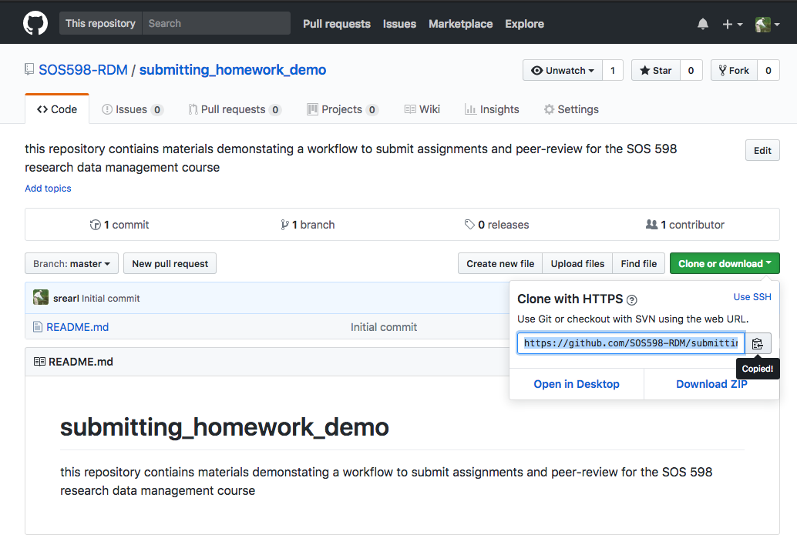

<!-- 
both full and relative paths to images work, syntax for each:
full

relative

-->

Now that we have the address to our repository, we can use GitKraken to clone it onto our computer. Cloning is like copying but with some additional functionality. By cloning, we are indeed copying the directory and its contents to our computer, but we are also establishing a link between the directory on our computer and the corresponding GitHub repository so that we can seamlessly move information between our computers and GitHub. 

*side note*: If you just wanted the contents of a GitHub repository but had no intention of pushing back to GitHub or using version control, we could have simply downloaded the repository instead of cloning (also on the green button mentioned above), and this would have downloaded a zipped file of the repository contents to our computer but would not maintain the linkage with GitHub.

Start GitKraken, and click on the folder icon in the top-left corner. This will bring up a Repository Management screen, where you can Open, Clone, or Init a repository. We want to clone a repository, so select that option. Once you select the option to clone a repository, you will see dialog boxes to the right for _Where to clone_, _URL_, and _Full path_. 

* _Where to clone_ is the location on your computer where you want GitKraken to place the directory it will clone from GitHub
* _URL_ is the address to the GitHub repository that we want to clone (and that we have copied to our clipboard in the above step)
* _Full path_ will be the full path to the repository on your computer once you have cloned it

The only thing you need to decide here is where to put the directory on your computer. I have a directory called _localRepos_ where I clone all of my GitHub repositories to my local computer. Technically, you can put the directory anywhere on your computer's file system and it will work fine, but give it some thought as using a consistent location and naming convention will contribute to a more efficient workflow. Some things to consider: (1) generally put the directory in a place where you can access it easily (e.g., do not bury it 10 directories deep), (2) avoid high-traffic areas like your Desktop, and (3) avoid a location that is synced with another service like Dropbox or iCloud. Pick a spot on your computer to place the repository with the browse button, paste the address to the repository that you copied from GitHub in the URL box, and hit the greenish _clone the repo button_ on the lower right. 

**GitKraken: respository management screen**
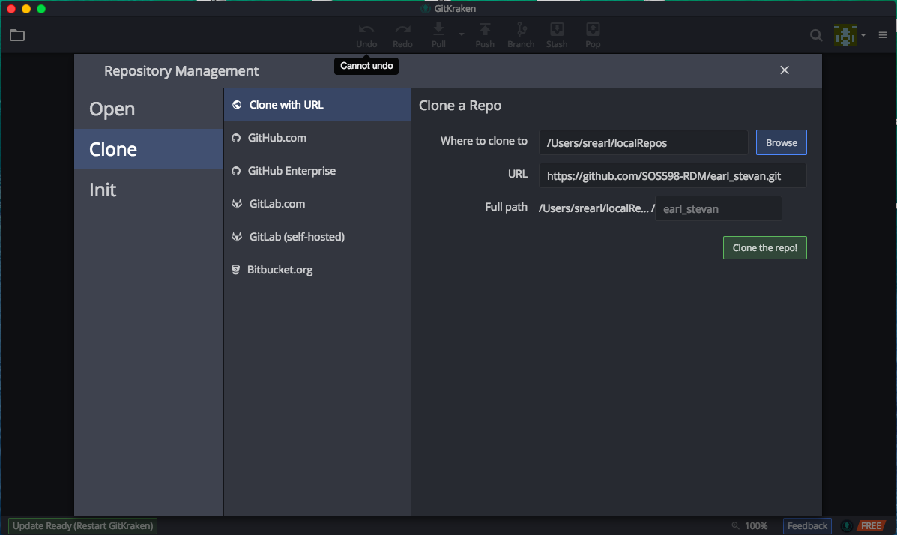

**If all went well, you should see a screen like the one below indicating that you successfully cloned the repo.**
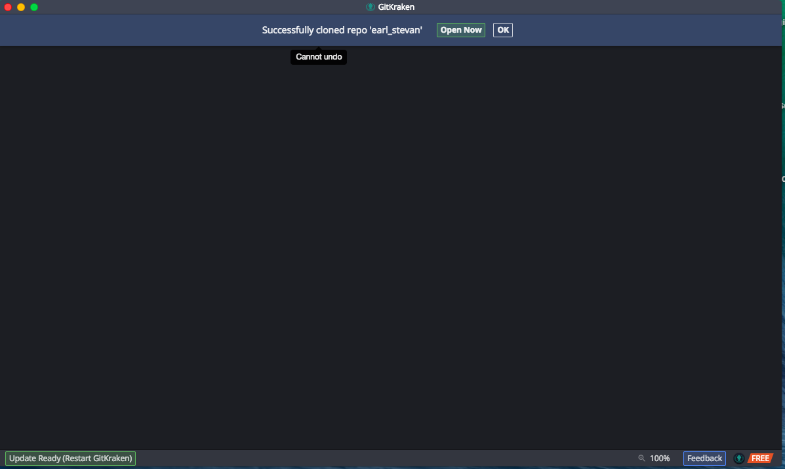

You can navigate to the repository immediately after cloning by hitting _OK_ when GitKraken asks if you want to open the repository now, or you can navigate to it later (or any time) by going back to the folder icon at the top-left of GitKraken, and instead of selecting the clone option, select the open option and navigate to your cloned directory.

At this point, you can navigate to the directory you just cloned to your computer using, for example, Finder or Windows Explorer just as you would any other directory on your computer. We will use GitKraken to facilitate the transfer of files from the directory on our local computer and our GitHub repository, as well as other Git functions, but the directory itself is just a folder on your computer much like any other folder except for a few unseen files needed by Git and GitHub.

**Using Mac's Finder, we see the *earl_stevan* repository that we just cloned from GitHub as a folder/directory in the *localRepos* directory on this MacBook.** 
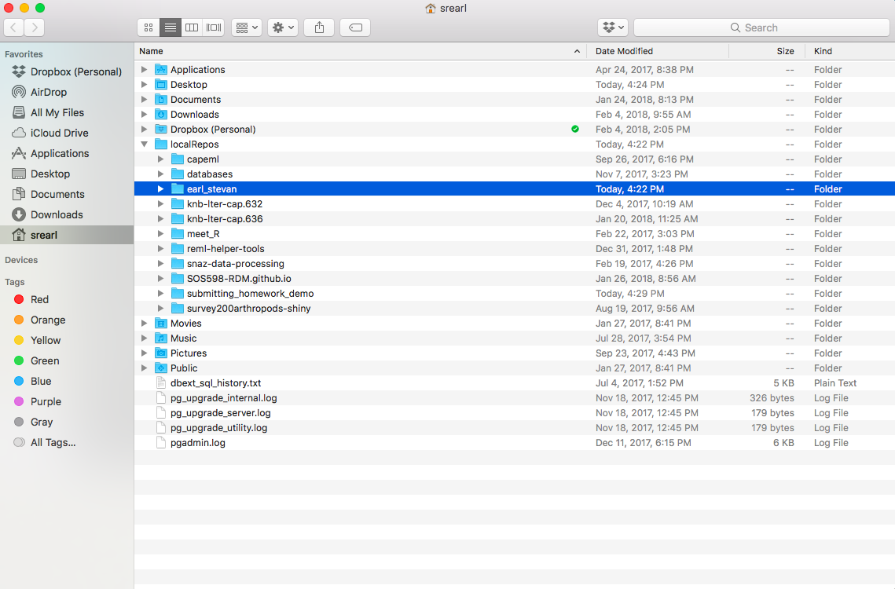

## populate your repository

Now that we have successfully cloned our GitHub repository, we can add files to and begin working on our project. At this point, we can generally forget about GitKraken and do the work that we want to accomplish - we will not need to revisit GitKraken until we are ready to commit (create a snapshot of our project), and, possibly, PUSH our work to GitHub. We will cover that in the next two steps. In the meantime, let us start our project with a simple markdown file.

I want start with a markdown file because of its simplicity, but also because we have had some difficulty actually creating a purely plain text file in class. What we mean by plain text is a file without any hidden encoding that denotes things like bold font, lists, formulas, highlighting, etc. Plain text is fundamental to reproducible research. A challenge is that many popular tools for creating documents, such as Microsoft Word, Google Docs, and even Mac's TextEdit make it difficult to create plain text files. These software packages are feature rich and allow great flexibility when creating documents, but the encoding is not reproducible. 

For this example, I will use Mac's TextEdit. For those of you working on Windows machines, Notepad will allow you to create plain text files. There are definitely better text editors but we can use these tools that come pre-installed (TextEdit for Mac, Notepad for Windows) for now. Note that I had mentioned earlier in the course that we could use Microsoft Word so long as we save the file as a plain text files, but I have encountered a problem using that approach so please avoid using Word.

First, let us navigate to the directory on our computer, in my case *localRepos/earl_stevan*. You will notice straightaway that there is already a file in the repository titled *README.md*. This is a plain text, markdown file that GitHub added to your repository when it was created. The README is intended to provide some overview information about the repository. In fact, what you are reading currently is the README.md file in the repository for this guide. For this course, you can ignore the README file, but, in other circumstances, they are a great tool for providing details about the repository, including information to your future self, so take advantage of them.

**The contents of our cloned repository on the local computer as viewed through Mac Finder**
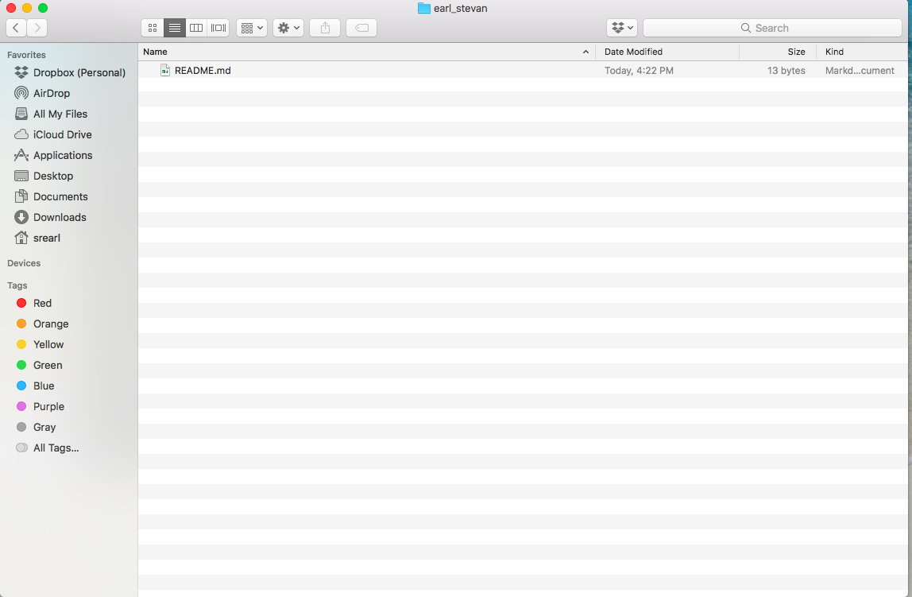

For now, let us start a new, plain-text, markdown file. Mac users can find TextEdit by searching for *text* in the launchpad. Windows users can find Notepad by clicking on the Windows icon and typing *Notepad* in the search window.

With TextEdit, we need to perform the preliminary step of telling TextEdit that we want to create a plain-text document. To do this, with TextEdit open, click the *Format* option from the menu bar and scroll down to the *Make Plain Tex* option.

**Telling Mac's TextEdit to create a plain-text file**
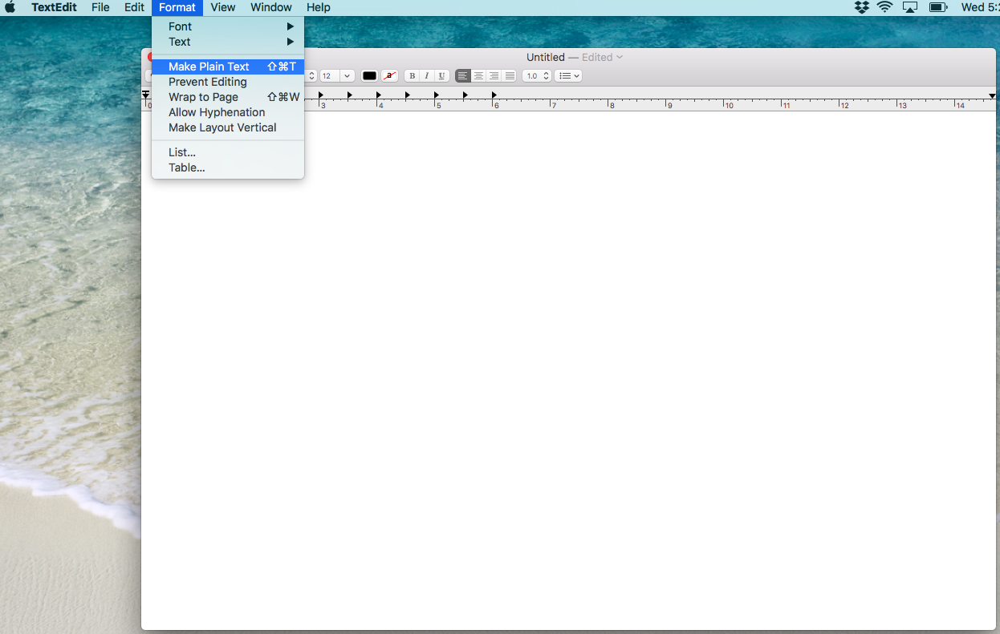

We can now begin creating our markdown document. Markdown itself is outside the scope of this overview, but please have a look at the *introduction/overview* and *reference sheet* materials under the *markdown* section in the list of *resources* on the main page of the course website for more information.

**In this simple markdown document, the** \# **symbol is a marker to create a level-one header (two** \#s **would be a level-two header, and so on), and the asterisks surrounding our Mayfly genus is a marker to italicize that word.**

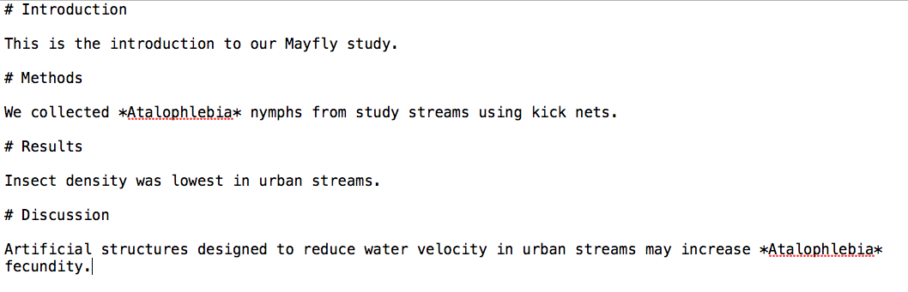
---

When ready, save the document to the directory on our computer that is a clone of the GitHub repository. There are additional steps that we need to do with Mac's TextEdit when saving:
* uncheck the box that says *If no extension is provided, use ".txt"*
* the save dialog box gives us several encoding options, here we will select UTF-8 (generally try to use UTF)
* use a logical filename and be sure to name it with the extension .md, which indicates that this is a markdown file

**Saving our new markdown file to the directory**
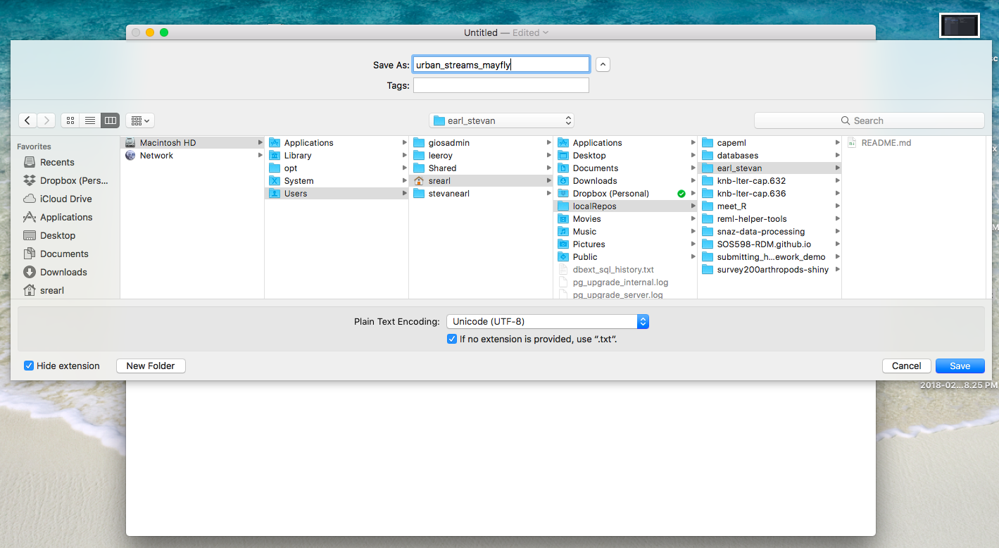

When we are ready to save a snapshot of our repository, we go back to GitKraken. Let us do that in the next few steps.

## add/stage, commit

Okay, let us say that we are at a point where we are ready to save a snapshot of our project. This can be for any number of reasons, such as:
* we have finished and are happy with it
* we want to create a snapshot at a point in time before we start a next phase of the project
* we are at a stopping point, and need to back up the work
* we need to share our progress with colleagues
* or others...

Go back to GitKraken or restart it if not open, and navigate to the repository where we are working if GitKraken is not already open to that location - remember that you can navigate to different repositories from the file icon in the top-left corner and use the open option from the repository navigation screen.

The dashboard screen for your repository should now look different, notably that there is a dashed-circle above our initial commit snapshot (indicated by the solid circle). This indicates that Git has noticed there is a change to the contents of the repository. You will also notice that the markdown file we created is in the *Unstaged Files* area.

**Git has detected that we have made a change to the repository**
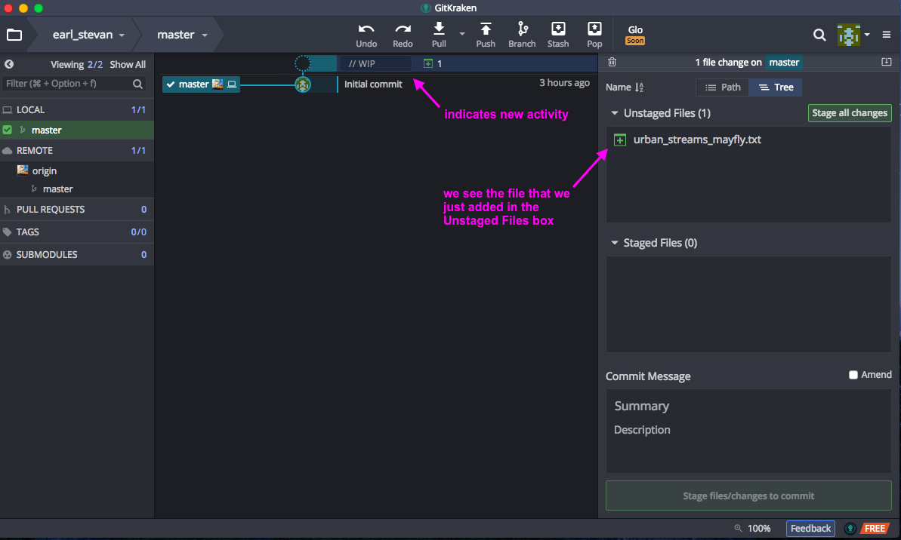

To create a snapshot of the repository, we first need to stage the files that we have added or edited. In this case there is only one file in the directory but there could be any number. If we hover over the file, we will see an option to stage the file. Press the green *Stage File* button to stage the file.

**Staging in GitKraken**
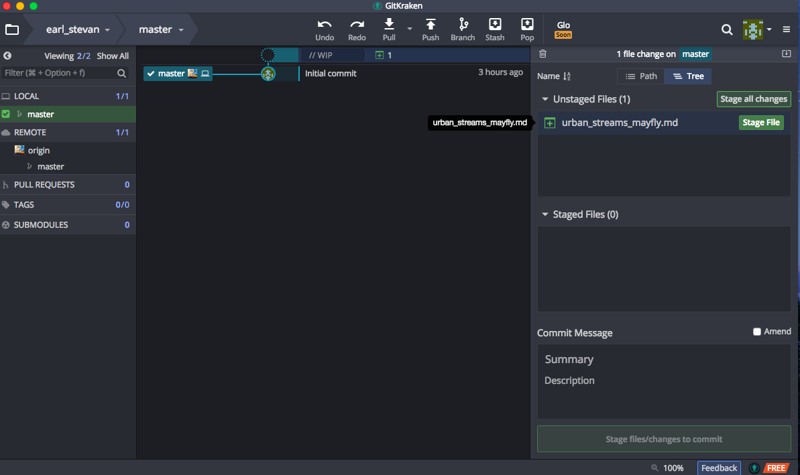

Once we have staged the file, it will have moved to the Staged Files area.

**Staged files in GitKraken**
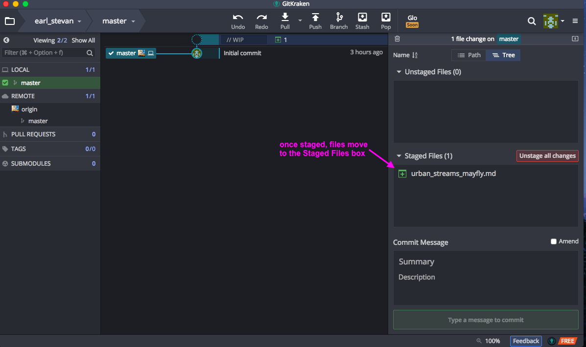

Now that all of our new files or edits have been staged, we can perform a commit to save a snapshot of the current state of the project. In order to commit, we must supply Git with a commit message. In GitKraken, this is done in the Commit Message area. Type in a short but meaningful message about the changes or progress that are associated with the project for this commit. When you have supplied some text, a green Commit button will appear to perform the commit.

**Commit in GitKraken**
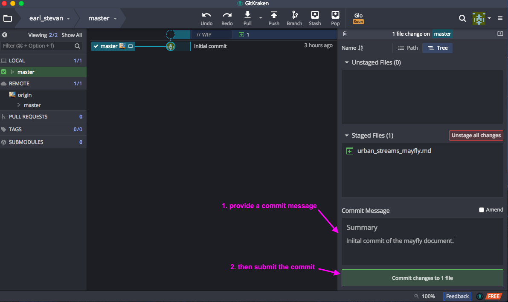

After our commit, we will see that GitKraken has changed again. The dotted circle indicating that Git had detected a change to our repository has changed to a solid circle with the corresponding commit message next to it. This is now the current state of the project.

**Commit in GitKraken**
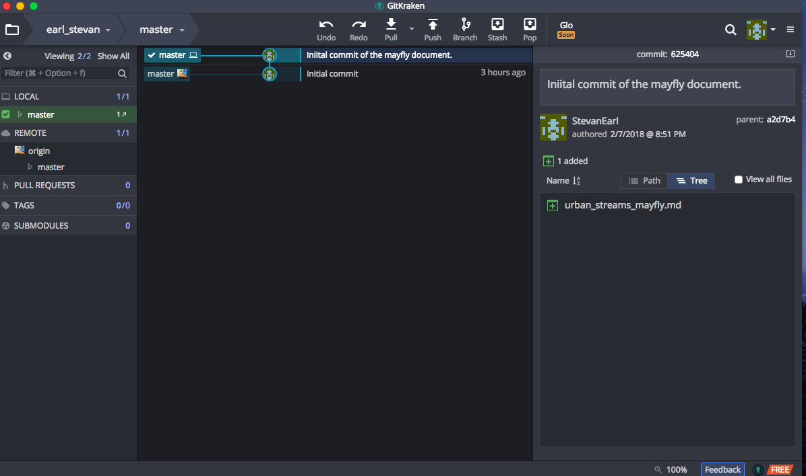

This is great, we have added a file to the directory on our computer that is our GitHub repository, and we have staged and commited the new files or changes, which has created a snapshot of our project as it stands at this time. However, everything thus far has only happened on our local computer. Now we want to PUSH all of the new files and/or edits we have made to this repository that lives on GitHub. We will do that in the next step.

## push files to your GitHub repository

When we are ready to PUSH the files and all associated changes we have made to our project to GitHub, we do that with a PUSH. After you have performed a successful commit, use the PUSH button in the top-center menu of GitKraken to PUSH the directory contents to your repository on GitHub.

**Push to GitHub in GitKraken**
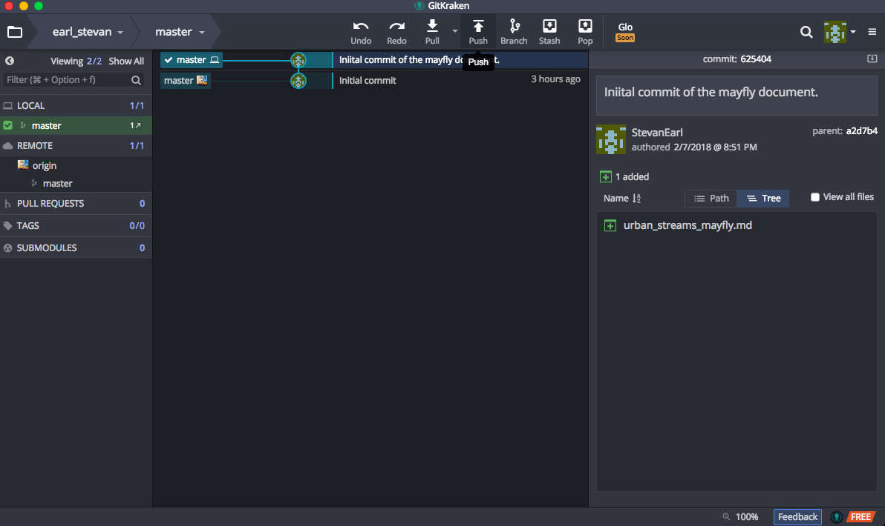

If all went well, you should see a small pop-up in GitKraken indicating that you successfully pushed the repository to GitHub. Now, we can go to that repository in GitHub to view the changes. Navigate to your repository in GitHub. If you already had it open, you may have to refresh the browser by clicking on the link to the repository or using the refresh button in your browser. You should now see the file that you added, staged, committed, and pushed in your repository.

**New file added to our GitHub repository**

In this case, because the file we added is a markdown file, when viewed in GitHub (by clicking on the name of the file), the markdown notation that we used for headers and italics are rendered on the screen.

**Our newly added file displayed in GitHub**
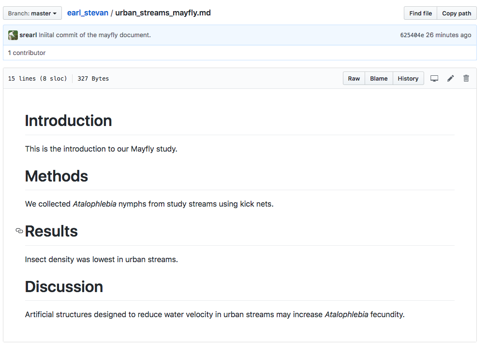

## open a GitHub issue when assignment is complete

The above steps are repeated as often as needed and appropriate, and typically many, many times over the life of a project. In our case, once you are ready to submit a final version of your project for a grade, you will open an issue after your last commit that will alert me that you are submitting your assignment. GitHub issues are a fabulous tool that facilitate project-specific discussions with other GitHub users inside or outside of your team. I also use issues as helpful reminders of problems or areas of a project that need attention, or where I have ideas to improve the project.

We will need a few pieces of information in order to create our issue, including the link to the file that is to be graded and the SHA of the commit that corresponds to the version (snapshot, or commit) of the project that is to be graded. Your repositories are relatively empty so it will be fairly obvious what you are submitting to be graded even without passing along those details, but a goal here is to gain some familiarity with GitHub and its many features.

The link to the file is what we had clicked on above to view our file in GitHub. Copy that url so that we can paste it into our issue when we create it. The SHA is the output of an algorithm generated from the contents of a file or directory, this gives us a way to reference commits. We can get the SHA of our commit from our commit history. To view the history of our project, we click on *commits* in our GitHub repository.

**Click on commits in our repository to see a history of our project**
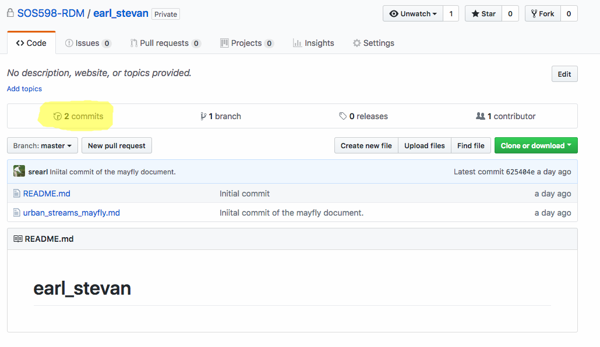

There are only two commits in the history of this project, the initial commit when the repository was established, and our initial commit of the mayfly document. These are ordered chronologically from most recent to oldest. To get the SHA of any given commit, click on the clipboard icon on the row of the commit you want to reference. In our case, the most recent commit is almost certainly going to be the commit you want to reference for your assignment, but referencing commits can be important on larger projects or when working in teams.

**Click on the clipboard icon on the row of the commit we want to reference to get the SHA for that commit**
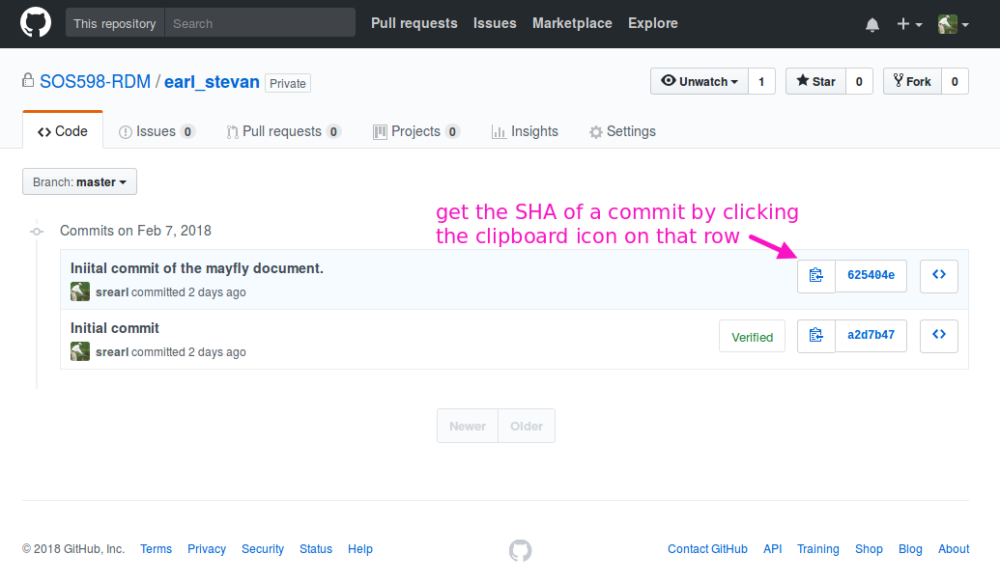

With the SHA copied to our computer's clipboard and the url to the file you are submitting (referenced above), we now have the pieces that we need to create an issue. 

To create an issue, first click on the *Issues* tab in the repository, then click on the green *New Issue* button.

**creating an Issue in our GitHub repository**
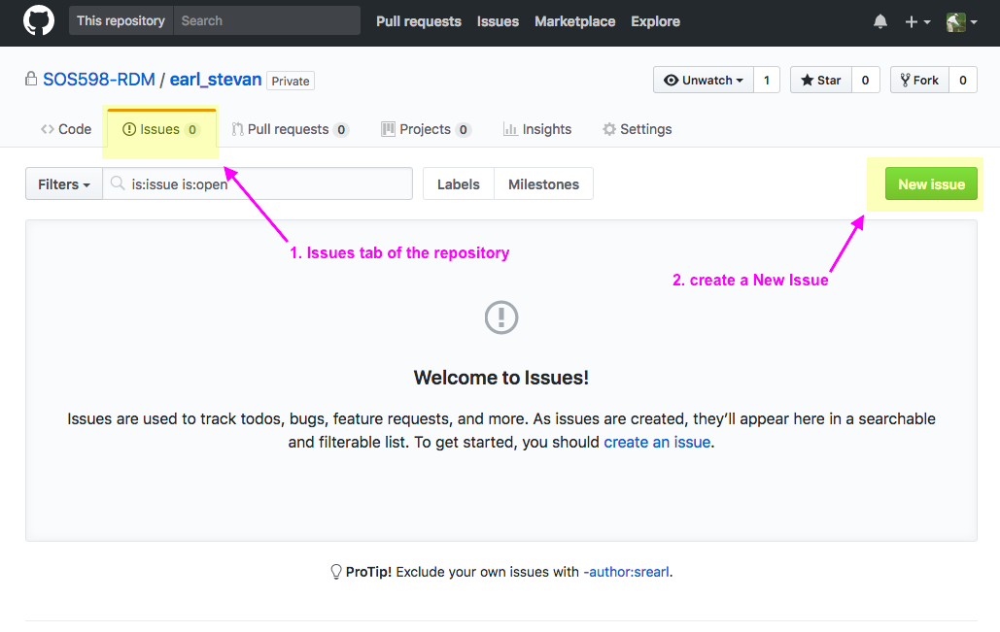

The title of our issue should have the format *mark assignment repository name*, so, for example, if this were the DMP assignment, this issue should have the title *mark DMP earl\_stevan*. The body of the issue should contain the SHA of the commit, and the url to the file that you are submitting, and a *mention* to Stevan using his GitHub user name (srearl). Mentions send a notification to the addressee alerting them of GitHub activity. Like some other social-media platforms (e.g., Twitter), mentions in GitHub use the @user-name format. When complete, submit the issue by clicking the green *Submit new issue* button.

**populating and submitting our Issue**
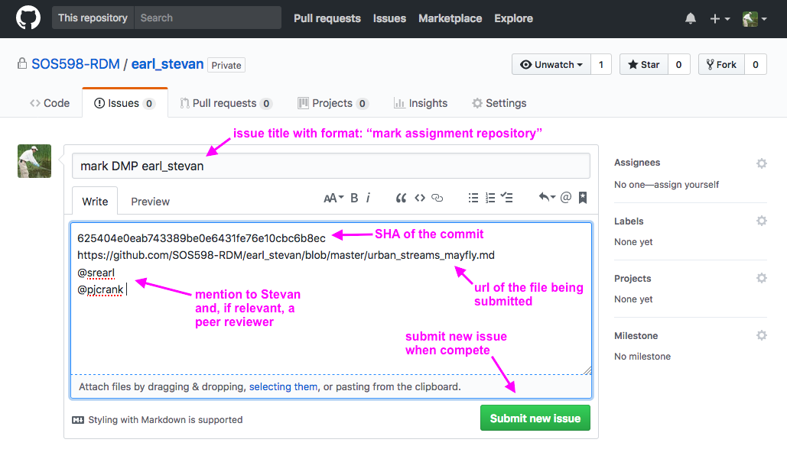

We now see that there is one issue in the *Issues* tab of our repository.

**our repository now has one issue**
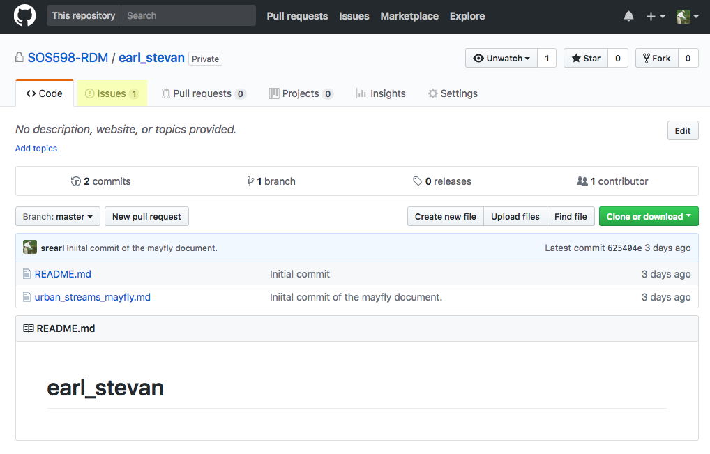

This concludes the steps for submitting your assignment. Please see the next section for addressing the peer review.

## submit peer review by opening a GitHub issue

Several of the assignments planned for the RDM course have a peer-review component. For these assignments, after assignment submission, the instructors will randomly assign each student to review the work of a peer. Each peer-review assignment will take the form of a GitHub issue that is assigned to the reviewer. This is somewhat opposite the flow of the GitHub issue created when submitting your assignment in that the instructors will create an issue that is assigned to the reviewer.

We can see how this will work with our example repository.

Upon receiving your GitHub mention that you have submitted your assignment (per the above step), Stevan will create a new issue assigned (as an issue *Assignee*) to a random peer. I am assigning myself as the Assignee in the example screenshot below but this would normally be the GitHub user name of one of your peers. To be clear, this is a step that the course instructors will address and is included here only to explain the process.

**peer review assignment**
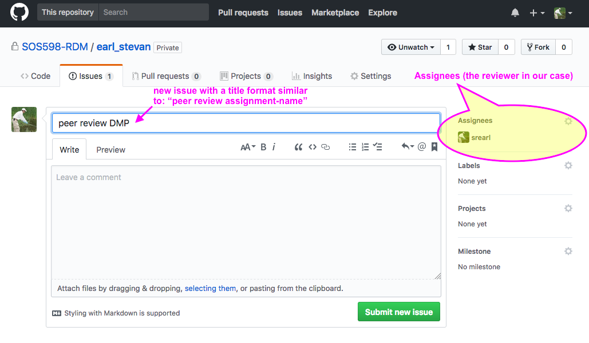

Okay, so the instructors create a new issue for each submitted assignment and assign a random peer to review that assignment. In this setup, the reviewer is the *Assignee* assigned to that issue - the Assignee will receive a notification when that issue is created. When you (the reviewer/Assignee) receive a notification (**please be sure that you have set your GitHub email notificication preferences such that you will be notified about Comments on Issues and Pull Requests**) that the issue has been created, navigate to the issue in GitHub, which will look something like the screenshot below. There are several ways to address the content of the review:
* write the text in a text editor then copy it into the comment box
* type directly into the comment box
* attach a file to the issue with the review content (GitHub allows GIF, JPEG, JPG, PNG, DOCX, GZ, LOG, PDF, PPTX, TXT, XLXS, and ZIP files as issue attachments)

The instructors would prefer that you please submit your review through the comment box either by copying and pasting from another file or typing directly into the comment box, but know that it is possible to attach files to GitHub issues. Before submitting the review, please be sure to include a mention to Stevan (@srearl) in the comment box.

**an assigned issue**
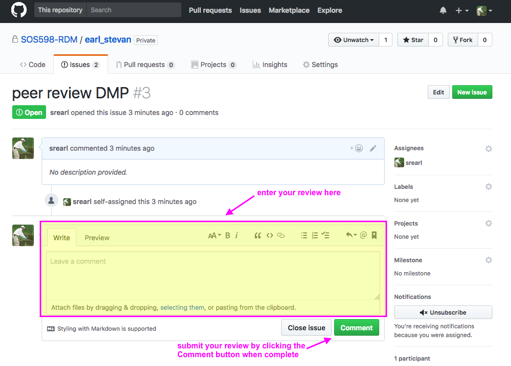

That concludes the process for submitting your review.
