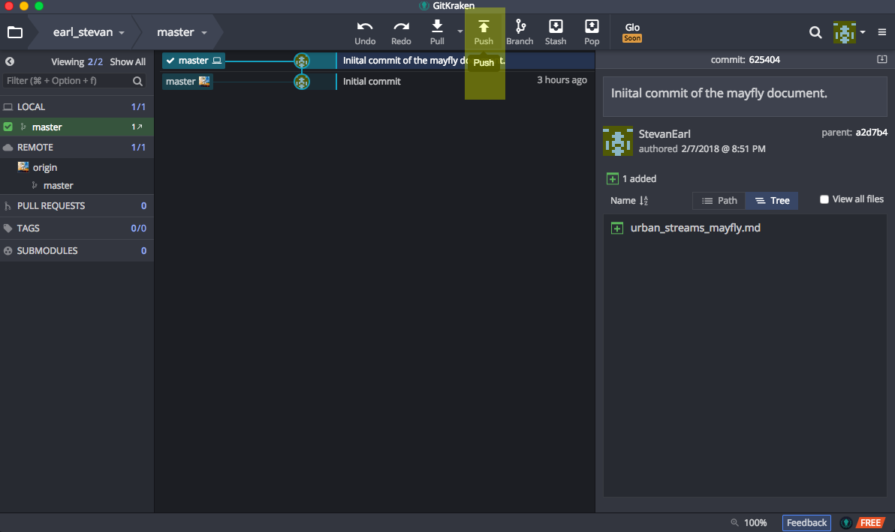
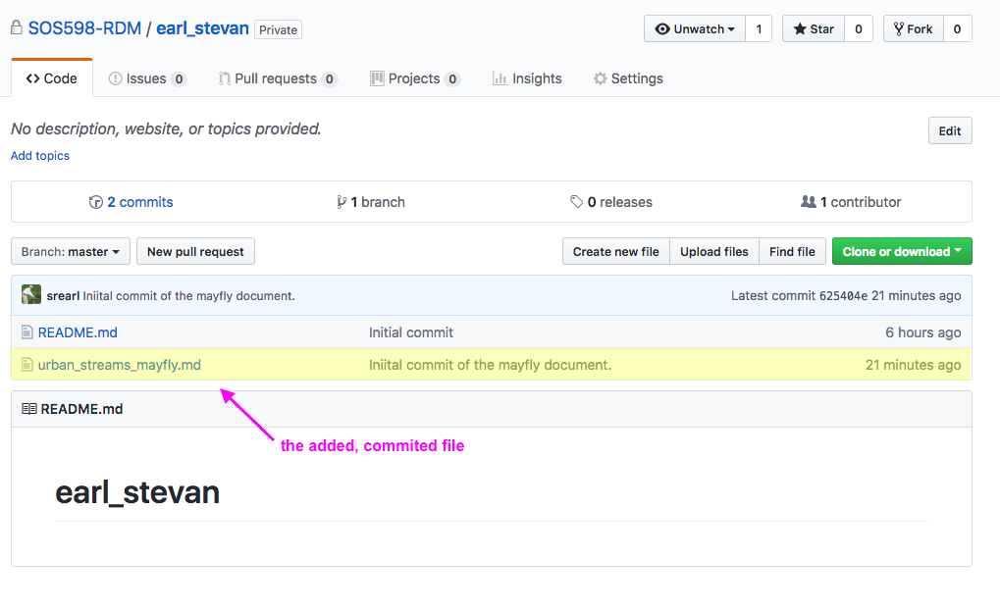

# SOS 598 Research Data Management assignment submission workflow

## Overview

Version control is a critical component of reproducible research. In this class, we will demonstrate the use of Git as an effective tool for version control. GitHub is a cloud-based platform that integrates with Git, and greatly extends its functionality. There is a learning curve to these tools for sure, but they are worth your time and effort. Rather than using manufactured examples, we will provide practical experience to these tools by using them for the homework assignments in this course. 

We have created for each of you a private GitHub repository within the SOS598-RDM GitHub organization. Repositories are identified by lastname_firstname. Only you have write access to your repository, but all students have read access to all repositories. As such, the assignments that you submit are viewable by your classmates, which, as explained below, is a critical features needed to address your peer reviews.

The general workflow to submitting assignments and addressing peer reviews is outlined below. Detailed instructions are provided in subsequent sections of the document. The instructions detailed here employ GitKraken to manage Git, but GitHub's Desktop software, or the command-line-interface would work just as well. There are links to GitKraken and GitHub Desktop on the front page of the course website. We will use the private repository *earl_stevan* as an example for this document.

**overview of steps**
1. clone your GitHub repository
2. populate your repository
3. add/stage, commit
4. push files to your GitHub repository
5. open a GitHub issue when assignment is complete
6. submit peer review by opening a GitHub issue

## clone your GitHub repository

GitHub is a cloud-based service. In this sense, we can think of GitHub kind of like Dropbox. Much like Dropbox, we do not actually work in GitHub. Rather, we work on our local machines, then add files to our repository on GitHub as needed. To do this, we first have to clone (similar to copy) our GitHub directory onto our local machine so that we can add files that we would like to manage with version control.

To clone your repository, we first need to get its address. Do this by navigating to your repository on GitHub, and clicking on the green *Clone or download* button. This will bring up a dialog box that displays the address of your repository. While this dialog box is open, clicking on the small icon that resembles a clipboard will copy the address to your computer's clip board.

**Repository address**

<!-- 
both full and relative paths to images work, syntax for each:
full

relative

-->

Now that we have the address to our repository, we can use GitKraken to clone it onto our computer. Cloning is like copying but with some additional functionality. By cloning, we are indeed copying the directory and its contents to our computer, but we are also establishing a link between the directory on our computer and the corresponding GitHub repository so that we can seamlessly move information between our computers and GitHub. 

*side note*: If you just wanted the contents of a GitHub repository but had no intention of pushing back to GitHub or using version control, we could have simply downloaded the repository instead of cloning (also on the green button mentioned above), and this would have downloaded a zipped file of the repository contents to our computer but would not maintain the linkage with GitHub.

Start GitKraken, and click on the folder icon in the top-left corner. This will bring up a Repository Management screen, where you can Open, Clone, or Init a repository. We want to clone a repository, so select that option. Once you select the option to clone a repository, you will see dialog boxes to the right for _Where to clone_, _URL_, and _Full path_. 

* _Where to clone_ is the location on your computer where you want GitKraken to place the directory it will clone from GitHub
* _URL_ is the address to the GitHub repository that we want to clone (and that we have copied to our clipboard in the above step)
* _Full path_ will be the full path to the repository on your computer once you have cloned it

The only thing you need to decide here is where to put the directory on your computer. I have a directory called _localRepos_ where I clone all of my GitHub repositories to my local computer. Technically, you can put the directory anywhere on your computer's file system and it will work fine, but give it some thought as using a consistent location and naming convention will contribute to a more efficient workflow. Some things to consider: (1) generally put the directory in a place where you can access it easily (e.g., do not bury it 10 directories deep), (2) avoid high-traffic areas like your Desktop, and (3) avoid a location that is synced with another service like Dropbox or iCloud. Pick a spot on your computer to place the repository with the browse button, paste the address to the repository that you copied from GitHub in the URL box, and hit the greenish _clone the repo button_ on the lower right. 

**GitKraken: respository management screen**

**If all went well, you should see a screen like the one below indicating that you successfully cloned the repo.**

You can navigate to the repository immediately after cloning by hitting _OK_ when GitKraken asks if you want to open the repository now, or you can navigate to it later (or any time) by going back to the folder icon at the top-left of GitKraken, and instead of selecting the clone option, select the open option and navigate to your cloned directory.

At this point, you can navigate to the directory you just cloned to your computer using Finder or Windows Explorer, for example, just like you would any other directory on your computer. We will use GitKraken to facilitate the transfer of files from the directory on our local computer and our GitHub repository, as well as other Git functions, but the directory itself is just a folder on your computer much like any other folder except for a few unseen files needed by Git and GitHub.

**Using Mac's Finder, we see the *earl_stevan* repository that we just cloned from GitHub as a folder/directory in the *localRepos* directory on my MacBook.** 

## populate your repository

Now that we have successfully cloned our GitHub repository, we can add files to and begin working on our project. At this point, we can generally forget about GitKraken and do the work that we want to accomplish - we will not need to revisit GitKraken until we are ready to commit (create a snapshot of our project), and, possibly, PUSH our work to GitHub. We will cover that in the next two steps. In the meantime, let us start our project with a simple markdown file.

I want start with a markdown file because of its simplicity, but also because we have had some difficulty actually creating a purely plain text file in class. What we mean by plain text is a file without any hidden encoding that denotes things like bold font, lists, formulas, highlighting, etc. Plain text is fundamental to reproducible research. A challenge is that many popular tools for creating documents, such as Microsoft Word, Google Docs, and even Mac's TextEdit make it difficult to create plain text files. These software packages are feature rich and allow great flexibility when creating documents, but the encoding is not reproducible. 

For this example, I will use Mac's TextEdit. For those of you working on Windows machines, Notepad will allow you to create plain text files. There are definitely better text editors but we can use these tools that come pre-installed (TextEdit for Mac, Notepad for Windows) for now. Note that I had mentioned earlier in the course that we could use Microsoft Word so long as we save the file as a plain text files, but I have encountered a problem using that approach so please avoid using Word.

First, let us navigate to the directory on our computer, in my case *localRepos/earl_stevan*. You will notice straightaway that there is already a file in the repository titled *README.md*. This is a plain text, markdown file that GitHub added to your repository when it was created. It is file designed to provide some overview information about the repository. In fact, what you are reading currently is the README.md file in the repository for this guide. For this course, you can ignore the README file, but, in other circumstances, they are a great tool for providing details about the repository, including information for your future self, so take advantage of them.

**The contents of our cloned repository on the local computer as viewed through Mac Finder**

For now, let us start a new, plain-text, markdown file. Mac users can find TextEdit by searching for *text* in the launchpad. Windows users can find Notepad by clicking on the Windows icon and typing *Notepad* in the search window.

With TextEdit, we need to perform the preliminary step of telling TextEdit that we want to create a plain-text document. To do this, with TextEdit open, click the *Format* option from the menu bar and scroll down to the *Make Plain Tex* option.

**Telling Mac's TextEdit to create a plain-text file**
 
**add missing image make_plain_text.png**
 

Now we can begin creating our markdown document. Markdown itself is outside the scope of this overview, but please read the *introduction/overview* and *reference sheet* materials on under the *resources/markdown* section of the main page of the course website.

**In this simple markdown document, the** \# **symbol is a marker to create a level one header (two** \# **'s would be a level two header, and so on), and the asterisks surrounding our Mayfly genus is a marker to italicize that word.**
 
 

---

When ready, save the document to the directory on our computer that is a clone of the GitHub repository. There are additional steps that we need to do with Mac's TextEdit when saving:
* uncheck the box that says *If no extension is provided, use ".txt"*
* the save dialog box gives us several encoding options, here we will select UTF-8 (generally try to use UTF)
* use a logical filename and be sure to name it with the extension .md, which indicates that this is a markdown file

**Saving our new markdown file to the directory**

When we are ready to save a snapshot of our repository, we go back to GitKraken. Let us do that in the next few steps.

## add/stage, commit

Okay, let us say that we are at a point where we are ready to save a snapshot of our project. This can be for any number of reasons, such as:
* we have finished and are happy with it
* we want to create a snapshot at a point in time before we start a next phase of the project
* we are at a stopping point, and need to back up the work
* we need to share our progress with colleagues
* or others...

Go back to GitKraken or restart it if not open, and navigate to the repository where we are working if GitKraken is not already open to that location - remember that you can navigate to different repositories from the file icon in the top-left corner and use the open option from the repository navigation screen.

The dashboard screen for your repository should now look different, notably that there is a dashed-circle above our initial commit snapshot (indicated by the solid circle). This indicates that Git has noticed there is a change to the contents of the repository. You will also notice that the markdown file we created is in the *Unstaged Files* area.

**Git has detected that we have made a change to the repository**

To create a snapshot of the repository, we first need to stage the files that we have added or edited. In this case there is only one file in the directory but there could be any number. If we hover over the file, we will see an option to stage the file. Press the green *Stage File* button to stage the file.

**Staging in GitKraken**

Once we have staged the file, it will have moved to the Staged Files area.

**Staged files in GitKraken**

Now that all of our new files or edits have been staged, we can perform a commit to save a snapshot of the current state of the project. In order to commit, we must supply Git with a commit message. In GitKraken, this is done in the Commit Message area. Type in a short but meaningful message about the changes or progress that are associated with the project for this commit. When you have supplied some text, a green Commit button will appear to perform the commit.

**Commit in GitKraken**

After our commit, we will see that GitKraken has changed again. The dotted circle indicating that Git had detected a change to our repository has changed to a solid circle with the corresponding commit message next to it. This is now the current state of the project.

**Commit in GitKraken**

This is great, we have added a file to the directory on our computer that is our GitHub repository, and we have staged and commited the new files or changes, which has created a snapshot of our project as it stands at this time. However, everything thus far has only happened on our local computer. Now we want to PUSH all of the new files and/or edits we have made to this repository that lives on GitHub. We will do that in the next step.

## push files to your GitHub repository

When we are ready to PUSH the files and all associated changes we have made to our project to GitHub, we do that with a PUSH. After you have performed a successful commit, use the PUSH button in the top-center menu of GitKraken to PUSH the directory contents to your repository on GitHub.

**Push to GitHub in GitKraken**

If all went well, you should see a small pop-up in GitKraken indicating that you successfully pushed the repository to GitHub. Now, we can go to that repository in GitHub to view the changes. Navigate to your repository in GitHub. If you already had it open, you may have to refresh the browser by clicking on the link to the repository or using the refresh button in your browser. You should now see the file that you added, staged, committed, and pushed in your repository.

**New file added to our GitHub repository**

In this case, because the file we added is a markdown file, clicking the link to the file in GitHub will open the file in the GitHub viewer. Note the markdown codes (headers, italics) are rendered in the viewer.

**Our newly added file displayed in GitHub**

## open a GitHub issue when assignment is complete

## submit peer review by opening a GitHub issue
