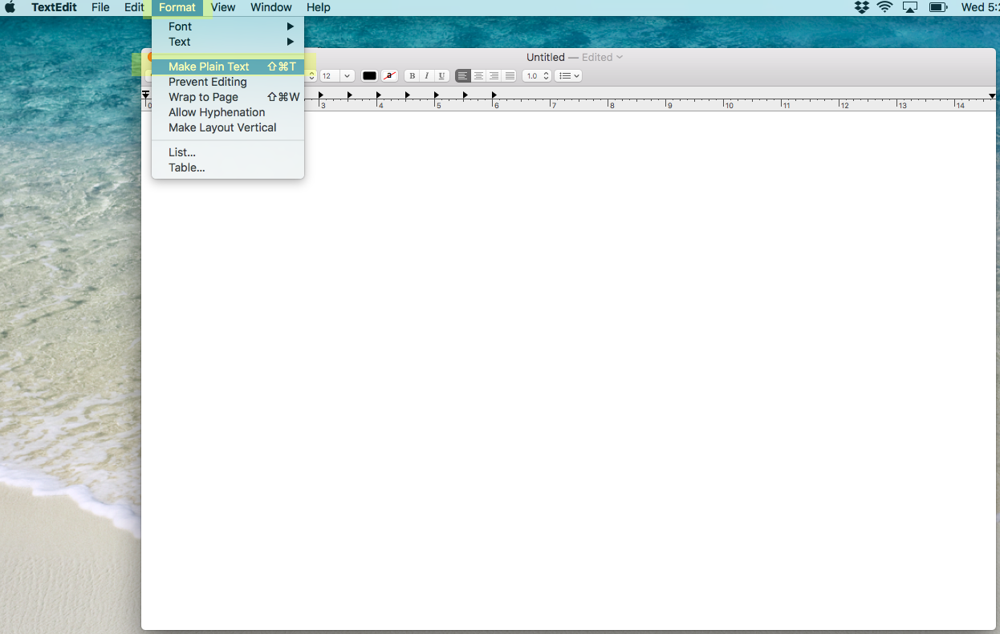
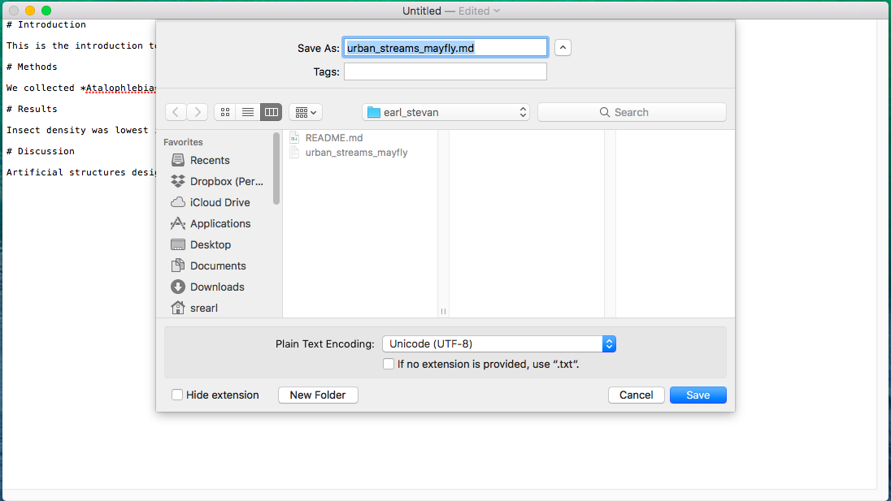

# SOS 598 Research Data Management assignment submission workflow

## Overview

Version control is a critical component of reproducible research. In this class, we will demonstrate the use of Git as an effective tool for version control. GitHub is a cloud-based platform that integrates with Git, and greatly extends its functionality. There is a learning curve to these tools for sure, but they are worth your time and effort. Rather than using manufactured examples, we will provide practical experience to these tools by using them for the homework assignments in this course. We have created for each of you a private GitHub repository within the SOS598-RDM GitHub organization. Repositories are identified by lastname_firstname. Only you have write access to your repository, but all students have read access to all repositories. As such, the assignments that you submit are viewable by your classmates, which, as explained below, is a critical features needed to address your peer reviews.

The general workflow to submitting assignments and addressing peer reviews is outlined below. Detailed instructions are provided in subsequent sections of the document. The instructions detailed here employ GitKraken to manage Git, but GitHub's Desktop software, or the command-line-interface would work just as well. There are links to GitKraken and GitHub Desktop on the front page of the course website. We will use the private repository earl_stevan as an example for this document.

**overview of steps**
1. clone your GitHub repository
2. populate your repository
3. add/stage, commit
4. push files to your GitHub repository
5. open a GitHub issue when assignment is complete
6. submit peer review by opening a GitHub issue

## clone your GitHub repository

GitHub is a cloud-based service. In this sense, we can think of GitHub kind of like Dropbox. Much like Dropbox, we do not actually work in GitHub. Rather, we work on our local machines, then add files to our repository on GitHub as needed. To do this, we first have to clone (similar to copy) our GitHub directory onto our local machine so that we can add files that we would like to manage with version control.

To clone your repository, we first need to get its address. Do this by navigating to your repository, and clicking on the green 'Clone or download' button. This will bring up a dialog box that displays the address of your repository. While this dialog box is open, clicking on the small icon that resembles a clipboard will copy the address to your computer's clip board.

<!-- 

both full and relative paths to images work, syntax for each:
full

relative

-->

Now that we have the address to our repository, we can use GitKraken to clone it onto our computer. It is important to point out that, though it like simply copying the directory from GitHub to our computer, it is not quite that simple. By cloning, we are indeed copying the directory and its contents to our computer, but we are also establishing a link between the directory on our computer and the corresponding GitHub repository so that we can seamlessly move information between our computers and the cloud. If, on the other hand, you just wanted the contents of a GitHub repository, and had no intention of pushing back to GitHub or using version control, we could have downloaded the repository instead of cloning (also on the green button mentioned above), and this would have downloaded a zipped file of the repository contents to our computer but would not maintain the linkage with GitHub - so not what we want in this case.

Start GitKraken, and click on the folder icon in the top-left corner. This will bring up a Repository Management screen, where you can Open, Clone, or Init a repository. We want to clone a repository, so select that option. Once you select the option to clone a repository, you will see dialog boxes to the right for _Where to clone_, _URL_, and _Full path_. _Where to clone_ is the location on your computer where you want GitKraken to place the directory it will clone from GitHub, _URL_ is the address to the GitHub repository that we want to clone (and that we have copied to our clipboard in the above step), and _Full path_ is the full path to the repository on your computer once you have cloned it. The only thing you need to decide here is where to put the directory on your computer. I have a directory called _localRepos_ where I clone all of my GitHub repositories to my local computer. It really does not matter, but give it some thought, and generally put the directory in a place where you can access it easily (e.g., do not bury it 10 directories deep) and avoid high-traffic areas like your Desktop. Pick a spot on your computer to place the repository with the browse button, paste the address to the repository that you copied from GitHub in the URL box, and hit the greenish _clone the repo button_ on the lower right. 

If all went well, you should see a screen like the one below indicating that you successfully cloned the repo.

You can navigate to the repository immediately after cloning by hitting _ok_ when GitKraken asks if you want to open the repository now, or you can navigate to it later (or anytime) by going back to the folder icon at the top-left of GitKraken, and instead of selecting the clone option, select the open option and navigate to your directory as you would navigate to any other directory.

At this point, you can navigate to the directory using Finder or Windows Explorer, for example, just like you would any other directory on your computer. We will use GitKraken to facilitate the transfer of files from the directory on our local computer and our GitHub repository, as well as other Git functions, but the directory itself is just a folder on your computer much like any other folder except for a few unseen files needed by Git and GitHub.

Here using Mac's Finder, we see the *earl_stevan* repository that we just cloned from GitHub as a folder/directory in the *localRepos* directory on my MacBook. 

## populate your repository

Now that we have successfully cloned our GitHub repository, we can add files to and begin working on our project. At this point, we can generally forget about GitKraken and do the work that we want to accomplish - we will not need to revisit GitKraken until we are ready to commit (create a snapshot of our project), and, possibly, PUSH our work to GitHub. We will cover that in the next two steps. In the meantime, let us start our project with a simple markdown file.

I want start with a markdown file because of its simplicity, but also because we have had some difficulty actually creating a purely plain text file in class. What we mean by plain text is a file without any hidden encoding that denotes things like bold font, lists, formulas, highlighting, etc. Plain text is integral to reproducible research. A challenge is that many popular tools for creating documents, such as Microsoft Word, Google Docs, and even Mac's text edit make it difficult to create plain text files. These software packages are feature rich and allow great flexibility when creating documents, but the encoding is not reproducible. For this example, I will use Mac's text edit. For those of you working on Windows machines, Notepad will allow you to create plain text files. Much better text editors exist, but we can use these tools, which come pre-installed (text edit for Mac, Notepad for Windows), for now. Note that I had mentioned early in the course that we could use Microsoft Word so long as we save them as plain text files, but I have encountered a problem using that approach so please avoid using Word.

First, let us navigate to the directory on our computer, in my case *localRepos/earl_stevan*. You will notice straightaway that there is already a file in the repository titled *README.md*. This is a plain text, markdown file that GitHub added to your repository when it was created. It is file designed to provide some overview information about the repository. In fact, what you are reading currently is the README.md file in the repository for this guide. For this course, you can ignore the README file, but, in other circumstances, they are a great tool for providing details about the repository, including information for your future self, so take advantage of them.

For now, let us start a new plain text, markdown file, again, in this case, using Mac's text edit. For you Mac users, you can find text edit by searching for *text* in your launchpad. For you Windows users, you can find Notepad by clicking on the Windows icon and typing *Notepad* in the search window.

With text edit, we need to perform the preliminary step of telling text edit that we want to create a plain text document. To do this, with text edit open, click the *Format* option from the menu bar and scroll down to the *Make Plain Tex* option.

Now we can begin creating our markdown document. Markdown itself is outside the scope of this overview, but please read the *introduction/overview* and *reference sheet* materials on under the *resources/markdown* section of the main page of the course website.

## add/stage, commit
## push files to your GitHub repository
## open a GitHub issue when assignment is complete
## submit peer review by opening a GitHub issue
