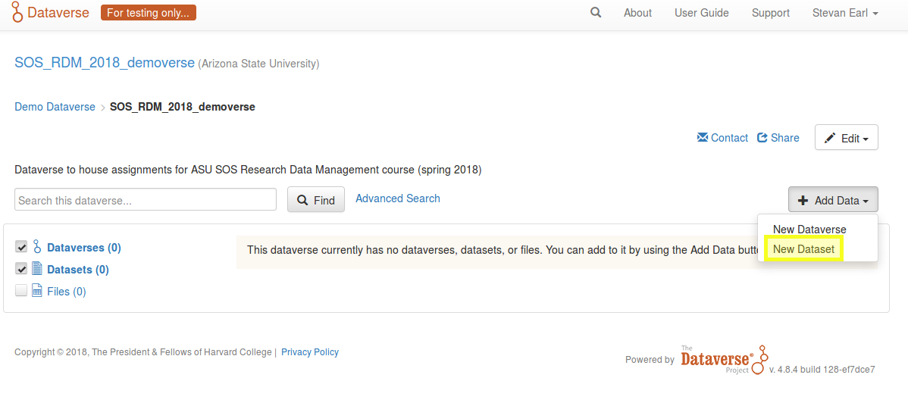
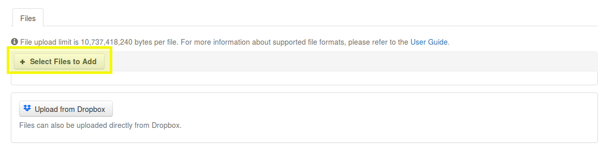
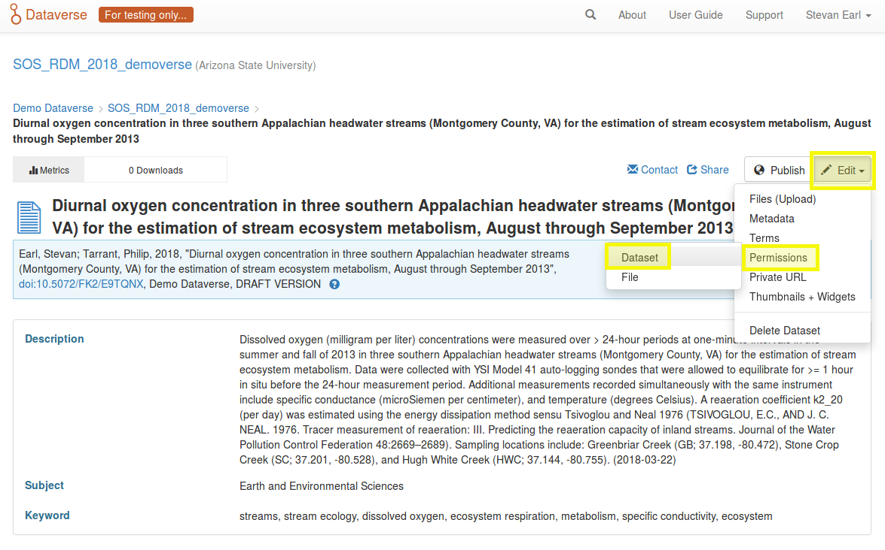
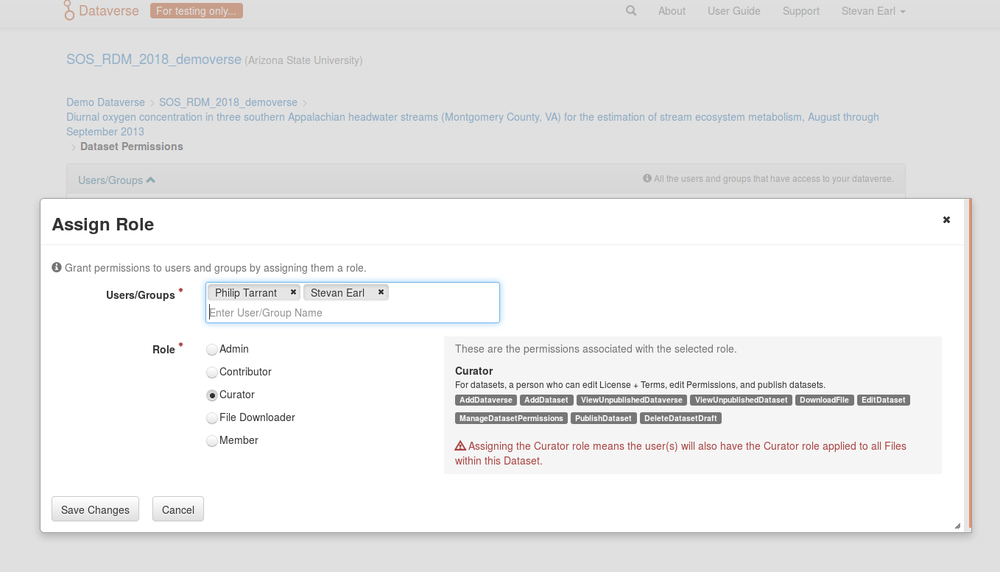

# SOS 519/598 Research Data Management: data-publishing exercise

1. [overview](https://github.com/SOS598-RDM/assignment_submission_workflow/blob/master/data_publication_exercise.md#overview)
2. [accessing and navigating HDD](https://github.com/SOS598-RDM/assignment_submission_workflow/blob/master/data_publication_exercise.md#accessing-and-navigating-hdd)
3. [adding your data set](https://github.com/SOS598-RDM/assignment_submission_workflow/blob/master/data_publication_exercise.md#adding-your-data-set)
4. [add data file(s)](https://github.com/SOS598-RDM/assignment_submission_workflow/blob/master/data_publication_exercise.md#add-data-files)
5. [save and add collaborators](https://github.com/SOS598-RDM/assignment_submission_workflow/blob/master/data_publication_exercise.md#save-and-add-collaborators)

## overview

In this exercise, you will submit a well-documented set of your own data (or data related to your research) to [Harvard's demo dataverse (HDD)](https://demo.dataverse.org/). HDD is a development or scratch environment version of the University's dataverse repository - please be absolutely certain that you address this exercise in the *demo* environment!

The infrastructure and metadata standard that HDD employs does not accommodate metadata for individual data files. An implication of this limitation is that we are unable to add metadata, such as the meaning of columns in our tabular data, units of measure, missing value codes, or factor levels for each data file. There are several approaches to addressing these critical metadata, such as embedding the metadata in the data file, or adding structured (e.g., frictionless) or unstructured (e.g., a README) metadata in an accompanying metadata file. Please review the materials in [generating metadata for tabular and non-tabular data resources](https://github.com/SOS598-RDM/rdm-lecture-metadata/blob/master/data/stream_chemistry_metadata.md) for an overview of different approaches.

## accessing and navigating HDD

ASU has an institutional affiliation with the Harvard dataverse so you will use ASU's ASURITE system to access HDD. Note that you *may* need to have enabled the ASU VPN if attempting to access the HDD from an off-campus network. Once you have authenticated with ASURITE by logging into MyASU or your ASU email, you can log into HDD by identifying Arizona State University as your institution.

A dataverse (a collection of datasets) has been created within HDD for this course, and is where you will publish your dataset: [ASU_SOS_519](https://demo.dataverse.org/dataverse/ASU_SOS_519) (or search for ASU_SOS_519 with the HDD). 

## adding your data set

Once you have logged into HDD and navigated to the class dataverse, you can begin the process of adding your data set by clicking the `Add Data` button, and selecting `New Dataset`.

 

 

Add appropriate metadata for your data set using the web-based form. The metadata contributed through the web form (e.g., title, author(s), keyword(s), etc.) will be associated with any and all data files added to this data set, so we can think of these metadata as being at the level of the data set. Note the ability to add additional metadata, such as geospatial details, by expanding additional sections at the bottom of the form.

## add a data file

HDD does not accommodate metadata for individual data files so metadata, such as how to interpret columns of tabular data, must be added to the file itself outside of HDD as noted above. Select and upload your data file. Depending on how you constructed metadata to describe the contents of your data file, upload accompanying metadata files as appropriate.

 

 

## save and add collaborators

After having added appropriate metadata using the web-based form, added your data file (and metadata file is appropriate), and reviewed the information for completeness and accuracy, save your data set with the `Save Dataset` button at the bottom of the form. Once saved, add me as a curator to your data set so that I am alerted to your submission and can access the information.

**add curators by first editing permissions of the data set: `Edit` > `Permissions` > `Dataset`**

 

 

**then assigning Users/Groups: `Assign Roles to Users/Groups`.** Because of the association with ASU, our names are registered in the system and searchable in the dialog box. Save changes, and you are done.

 

 
