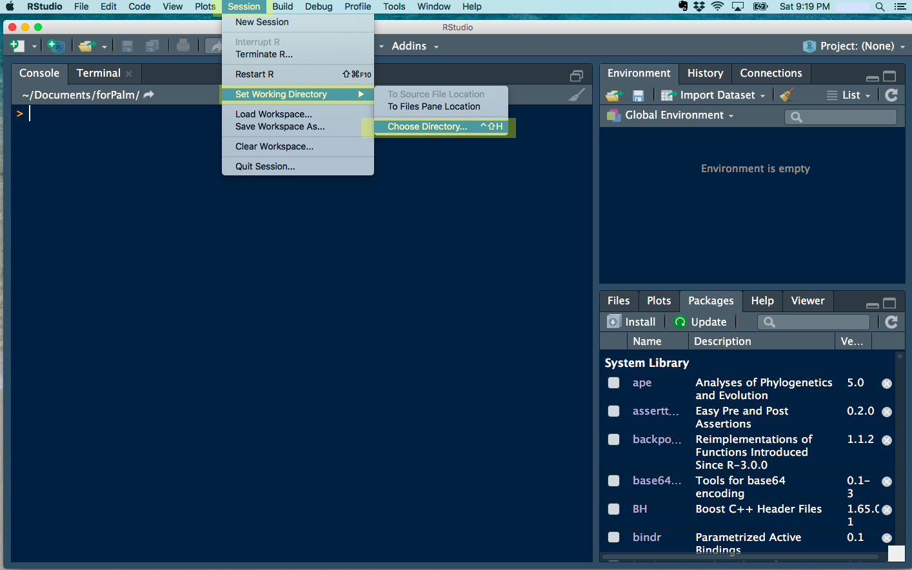
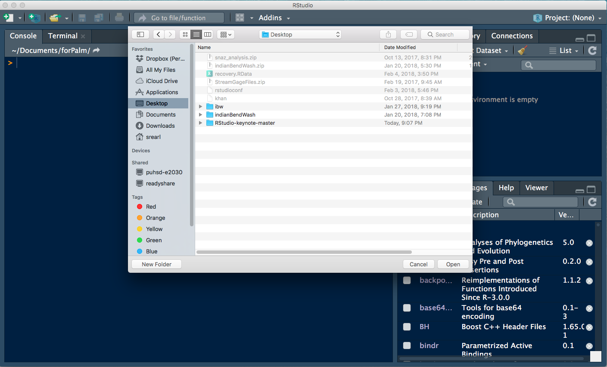
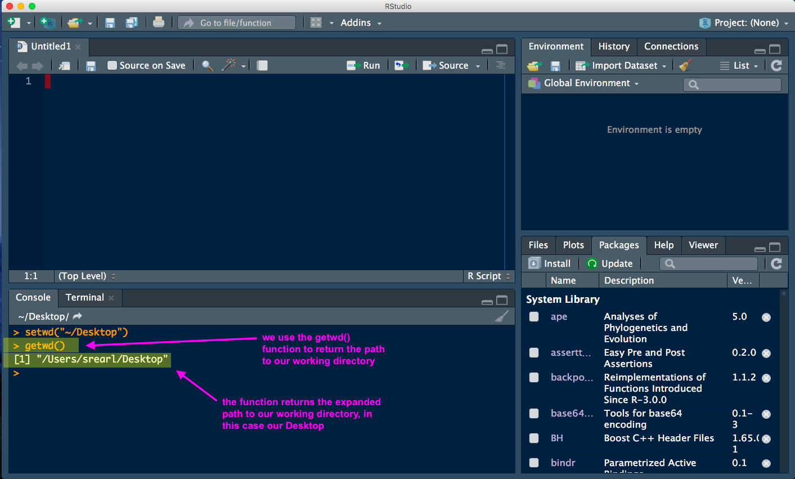

# use Rstudio session to find the path to a file

From the *Session* tab in RStudio, select *Set Working Directory* to *Choose Directory*. 

**selecting our session directory in RStudio**

This tool will open a familair file navigation GUI (e.g., Finder in Mac; Explorer in Windows). Navigate to a directory - any directory, but it must be a directory (not a file). This will tell RStudio to use this location as our working directory.

**navgiate to a directory (not a file!) and select open**

Setting the working directory is useful in itself, and something that you will do often when working with R, but our purpose here is to get the path (like the address) to our working directory. For that we can use the R function getwd(), which is an instruction to return the file path to the working directory.

**use the getwd() function in the R console to get the full path to our working directory**

