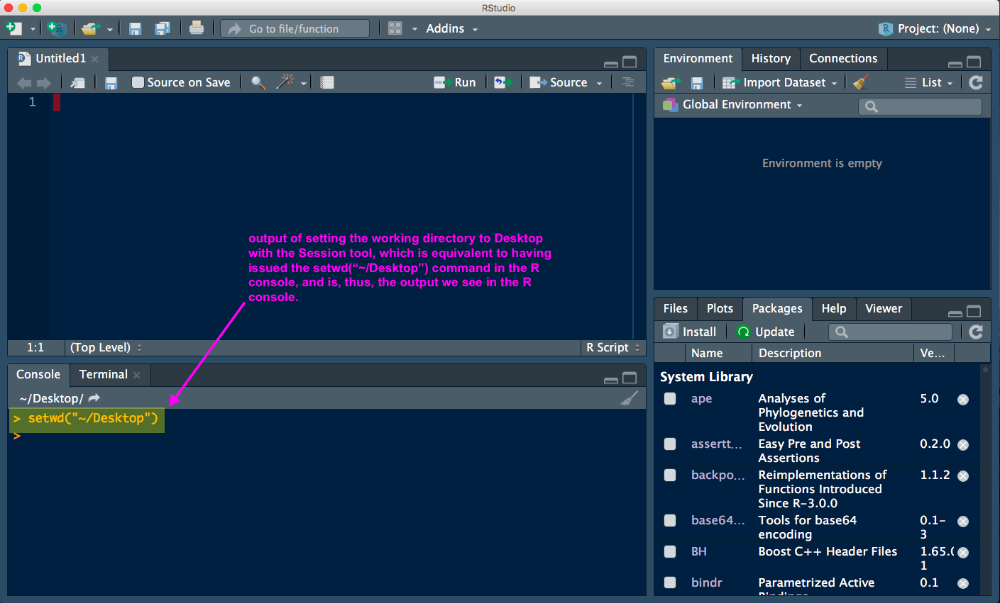

# The workflow below details how to use a familiar-feeling file navigation GUI in RStudio to set a working directory for an R session, then use a function in R to return the path of that working directory. This provides a way to identify the paths to directories in your computer's file structure such that you can navigate to them in a programming environment.

From the *Session* tab in RStudio, select *Set Working Directory* to *Choose Directory*. 

**selecting our session directory in RStudio**

This tool will open a familair file navigation GUI (e.g., Finder in Mac; Explorer in Windows). Navigate to a directory - any directory, but it must be a directory (not a file). This will tell RStudio to use this location as our working directory.

**navgiate to a directory (not a file!) and select Open - in this example, navigating to the Desktop, which is just a directory on the computer**

After you set the working directory using the Session tool in RStudio, you will see the results of this action in the R console (typically the lower-left quadrant within RStudio). In our example, having set the Desktop as the working directory, the output is \>setwd("~/Desktop"). Essentially what the Session tool has done is to call the commonly used setwd() function in R, which is the function to set the working directory - in our case, we had used the Session tool but, if we had known the path to our directory, we could have called the function setwd("~/Desktop") to get the same result. Note here that the path to our Desktop has the form ~/Desktop. The tilde (~) is a short-cut to the home directory. Often this abbreviated form will work fine but not always, and sometimes you will need to include the full path to files and directories in your programming. For our purposes here (i.e., practicing navigating our computer by file path), we definitely want the full path.

**the Session tool in RStudio will set the working directory to the directory we selected with the file navigator**

Setting the working directory is useful in itself, and something that you will do often when working with R, but our purpose here is to get the path (like the address) to our working directory. For that we can use the R function getwd(), which is an instruction to return the file path to the working directory. getwd() will return the full path (commonly referred to as the expanded path) of our working directory without using the tilde notation. Note that the location is the same with or without the tilde, the tilde is merely an abbreviation.

**use the getwd() function in the R console to get the full path to our working directory**

Practice this with many different directories on your computer to get a good sense of where items exist within your computer's file structure, and how you can navigate to them in a programming environment - this is an essential skill for successful programming.
